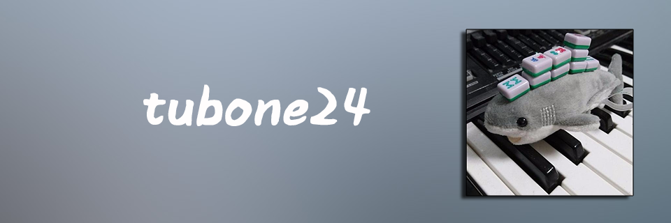

### Hi there 👋

I'm tubone.

I'm a Software developer with over 4+ years and the latest trying to tech lead with engineering teams. Expert at AWS by using Server-less architecture.

And also, I'm an amateur DTM composer and Guitarist (collaborating with [chocoholic](https://chocoholic.stores.jp/)).

Please feel free to give me a shout out [@meitante1conan](https://twitter.com/meitante1conan). Feel free to reach out in case you want to just get in touch also.

&nbsp;&nbsp;
&nbsp;&nbsp;
&nbsp;&nbsp;
&nbsp;&nbsp;
&nbsp;&nbsp;
&nbsp;&nbsp;

### My Footprint 🌱

If you want to know my footprint, please check [my portfolio](https://portfolio.tubone-project24.xyz/) out.

 
<strong>What I am learning/working on these days</strong>

   - Python  
   - Nuxt.js  
   - Working with AWS  
   - Building CI/CD  
   - Blogging (Everything with new techs)  

 

<!--
**tubone24/tubone24** is a ✨ _special_ ✨ repository because its `README.md` (this file) appears on your GitHub profile.

Here are some ideas to get you started:

- 🔭 I’m currently working on ...
- 🌱 I’m currently learning ...
- 👯 I’m looking to collaborate on ...
- 🤔 I’m looking for help with ...
- 💬 Ask me about ...
- 📫 How to reach me: ...
- 😄 Pronouns: ...
- ⚡ Fun fact: ...
-->
